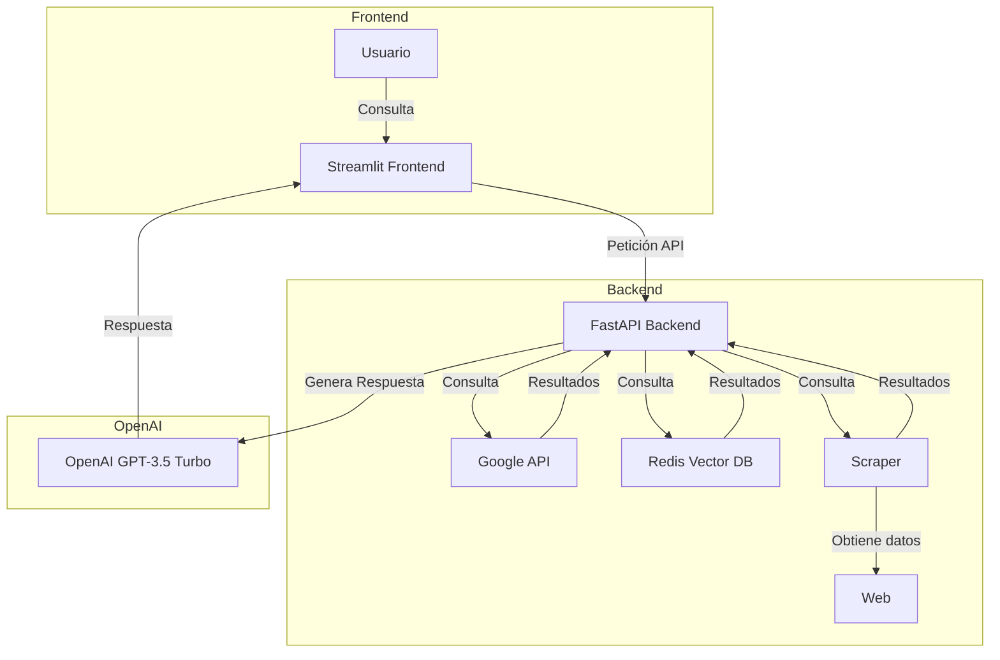
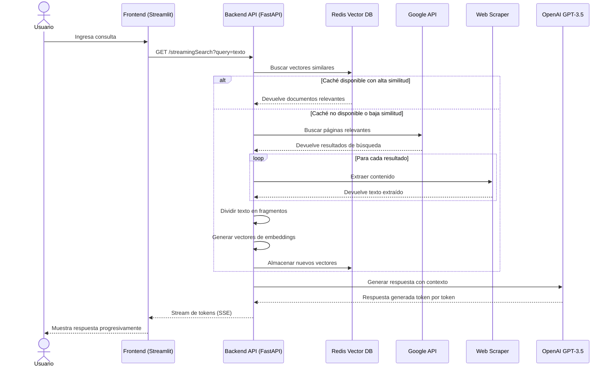

# InternetWhisper: Chatbot conversacional de IA con acceso a Internet

## Descripción del Proyecto

InternetWhisper es un avanzado chatbot conversacional de inteligencia artificial con capacidad para acceder a Internet en tiempo real. Inspirado en servicios como You.com y Google's Bard, este proyecto combina la potencia de los modelos de lenguaje de OpenAI con la capacidad de búsqueda web para ofrecer respuestas actualizadas y contextuales.

El sistema utiliza una arquitectura de recuperación aumentada por generación (RAG), donde:

1. Recibe consultas de usuarios a través de una interfaz intuitiva de Streamlit.
2. Busca información relevante en Internet usando la API de Google.
3. Utiliza técnicas avanzadas de scraping para extraer contenido de páginas web.
4. Almacena y recupera eficientemente la información en una base de datos vectorial Redis.
5. Procesa y sintetiza la información utilizando GPT-3.5 Turbo para generar respuestas coherentes y precisas.

El objetivo principal es proporcionar una herramienta de IA capaz de responder a preguntas sobre eventos actuales, conceptos técnicos o cualquier tema disponible en la web, superando las limitaciones de los modelos de lenguaje tradicionales basados únicamente en datos de entrenamiento estáticos.

## Explicación Técnica

La API está construida utilizando especificaciones OpenAPI, lo que facilita la documentación y la interoperabilidad con otras herramientas. A continuación, se describe un ejemplo de un endpoint incluido en el proyecto:

- **Endpoint**: `/streamingSearch`
- **Método**: `GET`
- **Parámetros**:
  - `query`: Parámetro requerido de tipo `string` que representa la consulta del usuario.
- **Respuesta**:
  - Código `200`: Devuelve una respuesta exitosa con datos en formato `text/event-stream`.

El archivo de especificación OpenAPI se encuentra en el repositorio y define todos los detalles técnicos de la API.

## Diagrama de Arquitectura y Flujo de Datos

A continuación, se presenta un diagrama que ilustra la arquitectura del proyecto y el flujo de datos entre los componentes principales:



### Explicación del Diagrama

1. **Frontend**:
   - El usuario interactúa con el frontend desarrollado en Streamlit, enviando consultas al chatbot.

2. **Backend**:
   - El backend, implementado con FastAPI, recibe las consultas del frontend y las procesa.
   - Dependiendo de la consulta, el backend puede:
     - Consultar la API de Google para obtener información relevante.
     - Buscar en la base de datos vectorial Redis para recuperar datos previamente almacenados.
     - Utilizar el scraper para extraer información de páginas web.

3. **OpenAI**:
   - Una vez que se recopila suficiente contexto, el backend utiliza la API de OpenAI para generar una respuesta basada en el modelo GPT-3.5 Turbo.

4. **Respuesta al Usuario**:
   - La respuesta generada se envía de vuelta al frontend, donde el usuario puede visualizarla en tiempo real.

## Principales Dependencias y su Función

El proyecto utiliza varias bibliotecas clave, cada una con un propósito específico:

| Dependencia | Versión | Función |
|-------------|---------|---------|
| Python | 3.10/3.11 | Lenguaje de programación base (No compatible con 3.13.1) |
| FastAPI | 0.104.0 | Framework web para construir APIs con Python, proporcionando alto rendimiento y validación automática. |
| Streamlit | 1.27.2 | Biblioteca para crear interfaces de usuario web interactivas con Python. |
| OpenAI | 0.28.0 | Cliente para acceder a los modelos de lenguaje de OpenAI, específicamente GPT-3.5 Turbo. |
| Redis | 5.0.1 | Base de datos en memoria, utilizada para almacenar vectores de incrustación y caché. |
| LangChain | 0.0.327 | Framework para desarrollar aplicaciones con LLMs, utilizado para dividir textos y procesar contenido. |
| BeautifulSoup4 | (incluida en bs4) | Biblioteca para análisis y extracción de datos HTML y XML. |
| Spacy | 3.7.2 | Biblioteca de procesamiento de lenguaje natural, utilizada para análisis de texto. |
| Playwright | 1.39.0 | Herramienta de automatización de navegador para scraping avanzado. |
| SSE-Starlette | 2.2.1 | Implementación de Server-Sent Events para FastAPI, permitiendo streaming de respuestas. |
| aiohttp | 3.8.6 | Cliente HTTP asíncrono para Python, utilizado en el scraper local. |

## Flujo de Trabajo de una Consulta




## Estructura del Proyecto

El proyecto está organizado de la siguiente manera:

- **`src/orchestrator`**: Contiene la lógica del backend, incluyendo la API de FastAPI y los módulos de recuperación de datos.
- **`src/frontend`**: Incluye el frontend desarrollado con Streamlit para interactuar con la API.
- **`src/scraper`**: Implementa un scraper para obtener datos de páginas web.
- **`docker-compose.yml`**: Archivo de configuración para orquestar los servicios del proyecto utilizando Docker.
- **`.env.example`**: Archivo de ejemplo para configurar las variables de entorno necesarias.

## Pasos para Configurar Variables de Entorno

Para ejecutar la aplicación, es necesario configurar las siguientes variables de entorno en un archivo `.env`:

```plaintext
HEADER_ACCEPT_ENCODING="gzip"
HEADER_USER_AGENT="Mozilla/5.0 (Macintosh; Intel Mac OS X 10_15_7) AppleWebKit/537.36 (KHTML, como Gecko) Chrome/116.0.0.0 Safari/537.36 (gzip)"
GOOGLE_API_HOST="https://www.googleapis.com/customsearch/v1?"
GOOGLE_FIELDS="items(title, displayLink, link, snippet,pagemap/cse_thumbnail)"
GOOGLE_API_KEY=<Tu Clave de API de Google>
GOOGLE_CX=<Tu ID de Motor de Búsqueda Personalizado de Google>
OPENAI_API_KEY=<Tu Clave de API de OpenAI>
```

1. Crea un archivo `.env` en la raíz del proyecto.
2. Copia las variables anteriores y reemplaza los valores `<...>` con tus claves y configuraciones específicas.

## Guía para Obtener los Datos Requeridos

Para que el proyecto funcione correctamente, es necesario configurar las siguientes variables de entorno en un archivo `.env`. A continuación, se explica cómo obtener cada uno de los valores requeridos:

### 1. **HEADER_ACCEPT_ENCODING**
   - Este valor (`gzip`) no requiere configuración adicional. Es un encabezado estándar que indica que las respuestas del servidor deben estar comprimidas en formato gzip.

### 2. **HEADER_USER_AGENT**
   - Este valor es un encabezado estándar que identifica el cliente (navegador o aplicación) que realiza la solicitud. El valor proporcionado en el ejemplo es suficiente y no requiere cambios.

### 3. **GOOGLE_API_HOST**
   - Este valor (`https://www.googleapis.com/customsearch/v1?`) es la URL base para realizar solicitudes a la API de Búsqueda Personalizada de Google. No requiere configuración adicional.

### 4. **GOOGLE_FIELDS**
   - Este valor (`items(title, displayLink, link, snippet,pagemap/cse_thumbnail)`) define los campos que se desean recuperar de la API de Google. No requiere configuración adicional.

### 5. **GOOGLE_API_KEY**
   - **Descripción**: Es la clave de API necesaria para autenticar las solicitudes a la API de Búsqueda Personalizada de Google.
   - **Cómo obtenerla**:
     1. Ve a la [Consola de Google Cloud](https://console.cloud.google.com/).
     2. Crea un nuevo proyecto o selecciona uno existente.
     3. Habilita la **API de Búsqueda Personalizada** desde la sección "Biblioteca de APIs".
     4. Ve a la sección **Credenciales** y crea una nueva clave de API.
     5. Copia la clave generada y pégala en el archivo `.env` como valor de `GOOGLE_API_KEY`.

   - **Documentación oficial**: [Google API Keys](https://cloud.google.com/docs/authentication/api-keys)

### 6. **GOOGLE_CX**
   - **Descripción**: Es el ID del motor de búsqueda personalizado que define el alcance de las búsquedas realizadas con la API de Google.
   - **Cómo obtenerlo**:
     1. Ve a la [página de Búsqueda Personalizada de Google](https://programmablesearchengine.google.com/about/).
     2. Crea un nuevo motor de búsqueda personalizado o selecciona uno existente.
     3. Copia el ID del motor de búsqueda (CX) desde la configuración del motor.
     4. Pega el ID en el archivo `.env` como valor de `GOOGLE_CX`.

   - **Documentación oficial**: [Custom Search JSON API](https://developers.google.com/custom-search/v1/overview)

### 7. **OPENAI_API_KEY**
   - **Descripción**: Es la clave de API necesaria para autenticar las solicitudes a los modelos de lenguaje de OpenAI, como GPT-3.5 Turbo.
   - **Cómo obtenerla**:
     1. Ve a la [página de OpenAI](https://platform.openai.com/signup/) y crea una cuenta si no tienes una.
     2. Accede al [panel de API](https://platform.openai.com/account/api-keys).
     3. Genera una nueva clave de API.
     4. Copia la clave generada y pégala en el archivo `.env` como valor de `OPENAI_API_KEY`.

   - **Documentación oficial**: [OpenAI API Keys](https://platform.openai.com/docs/quickstart)

---


## Pasos para Correr la Aplicación Localmente

### Opción 1: Usando Docker Compose

1. **Clonar el Repositorio**:
   ```bash
   git clone <url-del-repositorio>
   cd <directorio-del-repositorio>
   ```

2. **Configurar Variables de Entorno**:
   Asegúrate de haber configurado el archivo `.env` como se describe en la sección anterior.

3. **Construir y Ejecutar con Docker Compose**:
   ```bash
   docker-compose build
   docker-compose up
   ```

4. **Acceder a la Aplicación**:
   - Frontend: [http://localhost:8501](http://localhost:8501) (Streamlit UI)
   - Backend API: [http://localhost:8000](http://localhost:8000) (FastAPI)
   - Documentación API: [http://localhost:8000/docs](http://localhost:8000/docs) (Swagger UI)
   - Redis Insight (opcional): [http://localhost:6379](http://localhost:6379) (Redis Stack)

### Opción 2: Usando un Entorno Virtual en Python

1. **Clonar el Repositorio**:
   ```bash
   git clone <url-del-repositorio>
   cd <directorio-del-repositorio>
   ```

2. **Crear un Entorno Virtual**:
   - En Windows:
     ```bash
     python -m venv venv
     ```
   - En macOS/Linux:
     ```bash
     python3 -m venv venv
     ```

3. **Activar el Entorno Virtual**:
   - En Windows:
     ```bash
     venv\Scripts\activate
     ```
   - En macOS/Linux:
     ```bash
     source venv/bin/activate
     ```

4. **Instalar las Dependencias**:
   ```bash
   pip install -r requirements.txt
   ```

5. **Ejecutar la Aplicación**:
   ```bash
   uvicorn main:app --reload
   ```

6. **Acceder a la Aplicación**:
   - Backend API: [http://localhost:8000](http://localhost:8000)

## Ejemplo de Uso del Endpoint `/streamingSearch`

Puedes realizar una consulta al endpoint `/streamingSearch` utilizando `curl`:

```bash
curl -X GET "http://localhost:8000/streamingSearch?query=ejemplo"
```

La respuesta será un flujo de datos en formato `text/event-stream`.

## Configuración Avanzada

### Ajustar el comportamiento del Scraper

Puedes elegir entre dos implementaciones de scraper:

1. **ScraperLocal**: Implementación ligera basada en aiohttp, ideal para páginas simples:
   - Para activarlo, asegúrate de que en `main.py` esté configurado:
     ```python
     scraper = ScraperLocal()
     ```

2. **ScraperRemote**: Utiliza Playwright para renderizar JavaScript, útil para sitios web modernos:
   - Para activarlo, modifica en `main.py`:
     ```python
     scraper = ScraperRemoteClient()
     ```
   - Y asegúrate de descomentar los servicios relacionados en `docker-compose.yml`.

### Ajustar parámetros de similitud

Para controlar la sensibilidad de la recuperación de datos de caché:
```python
# Umbral más bajo = más probabilidad de usar caché existente
await retriever.get_context(query=query, cache_treshold=0.75, k=10)

# Umbral más alto = búsqueda web más frecuente
await retriever.get_context(query=query, cache_treshold=0.95, k=10)
```

## Errores Comunes y Soluciones

1. **Error de conexión al backend**:
   - **Causa**: El servicio del backend no está corriendo.
   - **Solución**: Asegúrate de que el contenedor de Docker para el backend esté activo.

2. **Clave de API no válida**:
   - **Causa**: Las claves de API de Google o OpenAI no son correctas.
   - **Solución**: Verifica las claves en el archivo `.env`.

3. **Problemas con el scraper**:
   - **Causa**: El scraper no puede acceder a ciertas páginas web.
   - **Solución**: Cambia entre `ScraperLocal` y `ScraperRemote` según sea necesario.

4. **Error de módulo no encontrado `sse_starlette`**:
   - **Causa**: Falta de instalación del módulo para Server-Sent Events.
   - **Solución**: Instalar el módulo con `pip install sse-starlette` y asegurarse de que esté en requirements.txt.

5. **Errores de compatibilidad de Python**:
   - **Causa**: Uso de Python 3.13.1 que causa incompatibilidades.
   - **Solución**: Utilizar Python 3.10 o 3.11 y recrear el entorno virtual.

6. **Errores de API de OpenAI**:
   - **Causa**: Uso de funciones deprecadas como `openai.Embedding.acreate`.
   - **Solución**: Actualizar las llamadas a `openai.Embedding.create` y utilizar `asyncio.run_in_executor`.

7. **ChunkedEncodingError en conexiones**:
   - **Causa**: Conexiones cerradas inesperadamente durante el streaming.
   - **Solución**: Aumentar timeouts y manejar excepciones adecuadamente en el código cliente.

8. **Errores con índices de Redis**:
   - **Causa**: Dimensiones incorrectas en los índices vectoriales.
   - **Solución**: Recrear el índice con la dimensión correcta (generalmente 1536 para embeddings de OpenAI).

9. **Errores por falta de importaciones**:
   - **Causa**: Módulos necesarios no importados, como `asyncio`.
   - **Solución**: Revisar y añadir las importaciones faltantes en los archivos correspondientes.

## Definición OpenAPI de la API

A continuación, se muestra la definición OpenAPI completa para el endpoint `/streamingSearch`:

```json
{
  "openapi": "3.0.0",
  "info": {
    "title": "InternetWhisper API",
    "description": "API para chatbot conversacional con acceso a Internet",
    "version": "0.1.0"
  },
  "paths": {
    "/streamingSearch": {
      "get": {
        "summary": "Realizar búsqueda y generar respuesta",
        "description": "Procesa una consulta, busca información relevante y genera una respuesta utilizando IA",
        "operationId": "streamingSearch",
        "parameters": [
          {
            "name": "query",
            "in": "query",
            "description": "Texto de la consulta del usuario",
            "required": true,
            "schema": {
              "type": "string"
            }
          }
        ],
        "responses": {
          "200": {
            "description": "Respuesta exitosa en formato streaming",
            "content": {
              "text/event-stream": {
                "schema": {
                  "type": "string"
                },
                "example": "event: search\ndata: {\"items\": [{\"link\": \"https://example.com\"}]}\n\nevent: context\ndata: información relevante recuperada\n\nevent: token\ndata: Respuesta\n\nevent: token\ndata: generada\n\n"
              }
            }
          },
          "400": {
            "description": "Parámetros de solicitud inválidos"
          },
          "500": {
            "description": "Error interno del servidor"
          }
        ]
      }
    }
  }
}
```

## Licencia

Este proyecto está licenciado bajo la Licencia MIT - ver el archivo [LICENSE](LICENSE) para más detalles.
